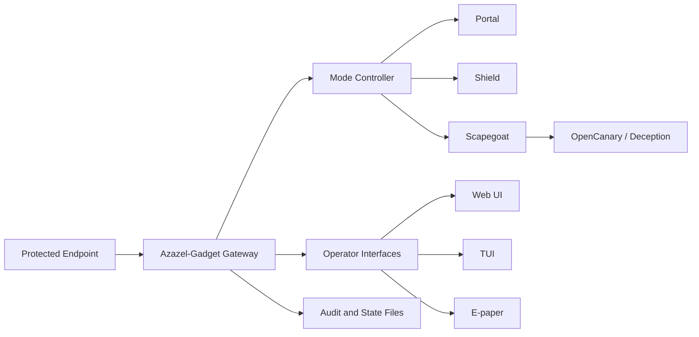

# AZ-02 Azazel-Gadget - Personal Tactical Defense Gateway

> **Codename:** `TACMOD`

<p align="center">
  <a href="https://github.com/01rabbit/Azazel-Gadget/releases">
    
  </a>
  <a href="https://github.com/01rabbit/Azazel-Gadget/actions/workflows/ci-tests.yml">
    
  </a>
  <a href="https://github.com/01rabbit/Azazel-Gadget/actions/workflows/pages.yml">
    
  </a>
</p>

<p align="center">
  <a href="./README_ja.md">
    
  </a>
  <a href="./README.md">
    
  </a>
</p>

<p align="center">
  
</p>
<p align="center">
  
  
  
  
  
  
</p>

Azazel-Gadget is the AZ-02 portable member of the Azazel system, a personal tactical defense gateway and Cyber Scapegoat Gateway for untrusted Wi-Fi, hostile local segments, and field use. It stands between the user's endpoint and the surrounding network, observes early network behavior, controls exposure through deterministic modes (`portal`, `shield`, `scapegoat`), and provides operator-visible state through Web UI, TUI, e-paper, and optional local notifications.

Azazel-Gadget is not a VPN, not a general-purpose travel router, and not a promise of complete attack prevention.

**Who this is for:** security researchers, field defenders, travelers, incident responders, red-team/blue-team operators, and users who need a portable defensive gateway for low-trust networks.

## Requirements

| Requirement | Detail |
|---|---|
| Hardware | Raspberry Pi Zero 2 W / Raspberry Pi 4-class devices |
| OS | Raspberry Pi OS / Linux |
| Runtime | Python 3.x, Flask-based local Web UI |
| Network | Protected client side on `usb0`, upstream side on `wlan0` |
| Optional | E-paper display, OpenCanary, Suricata, ntfy, portal viewer |

## Quick Start

```bash
sudo ./install.sh --all
# if prompted for reboot:
sudo ./install.sh --resume
```

Minimal verification:

```bash
sudo systemctl status azazel-mode azazel-first-minute azazel-control-daemon azazel-web --no-pager
```

## Architecture Overview



## What Azazel-Gadget does

- Runs as a portable defensive gateway.
- Provides deterministic operating modes (`portal`, `shield`, `scapegoat`).
- Keeps protected `usb0` clients separated from upstream inbound traffic.
- Supports Web UI, TUI, and e-paper visibility.
- Optionally exposes isolated deception services through OpenCanary.
- Optionally reflects Suricata/OpenCanary/ntfy state where implemented.
- Records state and mode changes for operator review.

## Security Boundary Summary

Azazel-Gadget claims:

- local-first defensive gateway behavior
- explicit operator-selectable modes
- no inbound path from upstream `wlan0` to protected `usb0` clients
- deterministic mode switching with audit-visible state
- optional deception exposure isolated from the protected client side

Azazel-Gadget does not claim:

- complete protection against all hostile Wi-Fi attacks
- replacement for endpoint security, VPN, or enterprise NAC
- autonomous offensive response
- invisible or zero-interaction security
- safe use without understanding the active mode

## Operating Modes

| Mode | Behavior | EPD Sample |
|---|---|---|
| `portal` | NAT/gateway behavior for protected `usb0` clients via upstream network. Deception exposure is off. |  |
| `shield` (default) | Default defensive posture. Inbound traffic from `wlan0` is dropped while protected client outbound path is preserved. |  |
| `scapegoat` | Only allowlisted OpenCanary ports are exposed. Canary runs in isolated namespace (`az_canary`) and is separated from protected client side. |  |

Warning display (not a mode):

| Display | Trigger | EPD Sample |
|---|---|---|
| `WARNING` | Alert conditions detected by monitoring pipeline. |  |

## Hardware Variants

| Azazel-Gadget Portable | Azazel-Gadget Dock |
|---|---|
| Raspberry Pi Zero 2 W implementation<br> | Raspberry Pi 3/4/4B implementation<br> |

## Interfaces

| Web UI | Unified TUI |
|---|---|
| [](images/WebUI.png) | [](images/TUI.png) |

Operator interfaces in the repository:

- Web UI backend and dashboard: `azazel_web/`
- Unified TUI monitor/menu: `py/azazel_gadget/cli_unified.py`
- Menu compatibility launcher: `py/azazel_menu.py`
- Terminal status panel: `py/azazel_status.py`
- E-paper renderer/controller: `py/azazel_epd.py`, `py/boot_splash_epd.py`

## Installation Options

Main entrypoint: `install.sh`

| Option | Effect |
|---|---|
| `--with-canary` | Installs/enables OpenCanary |
| `--with-epd` | Enables Waveshare E-Paper dependencies (default enabled) |
| `--with-webui` | Installs Flask venv + Caddy HTTPS reverse proxy |
| `--with-ntfy` | Installs local ntfy server and notification integration |
| `--with-portal-viewer` | Installs noVNC/Chromium captive-portal viewer stack |
| `--all` | Enables all optional features above |
| `--resume` | Resumes after reboot-required network stage |

## Web API

| Endpoint | Notes |
|---|---|
| `GET /` | Dashboard HTML |
| `GET /api/state` | Current state snapshot |
| `GET /api/state/stream` | SSE state stream |
| `GET /api/mode` | Current mode metadata |
| `POST /api/mode` | Switch mode (`portal`/`shield`/`scapegoat`) |
| `GET /api/portal-viewer` | noVNC status/URL |
| `POST /api/portal-viewer/open` | Start/open portal viewer |
| `GET /api/events/stream` | SSE bridge for ntfy topic events |
| `POST /api/action` | Action endpoint (v1 format) |
| `POST /api/action/<action>` | Action endpoint (legacy format) |
| `GET /api/wifi/scan` | Wi-Fi scan |
| `POST /api/wifi/connect` | Wi-Fi connect |
| `GET /api/certs/azazel-webui-local-ca/meta` | Local CA metadata |
| `GET /api/certs/azazel-webui-local-ca.crt` | Local CA download |
| `GET /health` | Backend health |

Allowed actions:
`refresh`, `reprobe`, `contain`, `release`, `details`, `stage_open`, `disconnect`, `wifi_scan`, `wifi_connect`, `portal_viewer_open`, `mode_set`, `mode_status`, `mode_get`, `mode_portal`, `mode_shield`, `mode_scapegoat`, `shutdown`, `reboot`

Token auth:

- Header: `X-AZAZEL-TOKEN` or `X-Auth-Token`
- Query: `?token=...`

## Services (systemd)

| Unit | Purpose |
|---|---|
| `azazel-mode.service` | Boot mode applicator (`azctl mode apply-default`) |
| `azazel-first-minute.service` | Main control-plane process |
| `azazel-control-daemon.service` | Unix socket action daemon |
| `azazel-web.service` | Flask backend API/UI |
| `azazel-portal-viewer.service` | Captive-portal viewer (noVNC) |
| `usb0-static.service` | Forces static IPv4 on `usb0` |
| `azazel-nat.service` | NAT and forwarding helper |
| `azazel-epd.service` | E-paper startup status |
| `azazel-epd-refresh.service` + `azazel-epd-refresh.timer` | E-paper periodic mode/state refresh |
| `azazel-epd-shutdown.service` | E-paper shutdown flow |
| `azazel-epd-portal.service` + `azazel-epd-portal.timer` | Captive-portal periodic checks |
| `suri-epaper.service` | Suricata-driven e-paper updates |
| `opencanary.service` | OpenCanary service |
| `opencanary@.service` | OpenCanary in dedicated network namespace |

## Documentation Map

Primary entry points:

- [Documentation Index](docs/INDEX.md)
- [Series Positioning and Terms](docs/SERIES_POSITIONING_AND_TERMS.md)
- [Security Claim Policy](docs/SECURITY_CLAIM_POLICY.md)
- [Installer Guide](installer/README.md)
- [Release Process](docs/RELEASE_PROCESS.md)
- [Release Notes Template](docs/RELEASE_NOTES_TEMPLATE.md)
- [Changelog](docs/CHANGELOG.md)
- [Presentation Assets](docs/presentation/README.md)
- [Docs Site Entry](docs/index.html)
- [Regression Test Notes](scripts/tests/regression/README.md)

## Repository Layout

| Path | Role |
|---|---|
| `py/azazel_gadget/` | Controller, sensors, tactics engine, path schema |
| `py/azazel_control/` | Control daemon, Wi-Fi handlers, action scripts |
| `azazel_web/` | Flask backend and dashboard assets |
| `systemd/` | Service and timer units |
| `installer/` | Staged installer framework |
| `configs/` | Default runtime configuration |
| `scripts/` | Runtime helpers and test scripts |
| `docs/` | Project documentation and presentation assets |
| `images/` | README and presentation image assets |

## License

No top-level `LICENSE` file is currently present in this repository.
