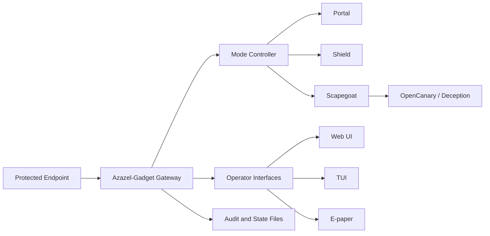

# AZ-02 Azazel-Gadget - Personal Tactical Defense Gateway

> **Codename:** `TACMOD`


[](https://github.com/01rabbit/Azazel-Gadget/actions/workflows/ci-tests.yml)
[](https://github.com/01rabbit/Azazel-Gadget/releases)
[](LICENSE)
[](docs/INDEX.md)
[](https://github.com/01rabbit/Azazel-Gadget/actions/workflows/pages.yml)


[](./README_ja.md)
[](./README.md)

Azazel-Gadget is the AZ-02 portable member of the Azazel system, a personal tactical defense gateway and Cyber Scapegoat Gateway for untrusted Wi-Fi, hostile local segments, and field use. It stands between the user's endpoint and the surrounding network, observes early network behavior, controls exposure through deterministic modes (`portal`, `shield`, `scapegoat`), and provides operator-visible state through Web UI, TUI, e-paper, and optional local notifications.

Azazel-Gadget moves the first-contact surface away from the user's endpoint.

Azazel-Gadget is not a VPN, not a general-purpose travel router, and not a promise of complete attack prevention.

**Who this is for:** security researchers, field defenders, travelers, incident responders, red-team/blue-team operators, and users who need a portable defensive gateway for low-trust networks.

## Why this exists

- Public Wi-Fi and hostile local segments expose endpoints to local discovery, probing, and opportunistic attack attempts.
- VPNs can protect traffic paths but do not remove the endpoint's local first-contact surface.
- Endpoint firewalls run on the endpoint itself.
- Travel routers provide connectivity but are not designed as observable tactical deception gateways.
- Azazel-Gadget places a controlled gateway and optional scapegoat surface in front of the endpoint.

## Requirements

| Requirement | Detail |
|---|---|
| Hardware | Raspberry Pi Zero 2 W / Raspberry Pi 4-class devices |
| OS | Raspberry Pi OS / Linux |
| Runtime | Python 3.x, Flask-based local Web UI |
| Network | `usb0` protected client side and `wlan0` upstream side |
| Optional | E-paper display, OpenCanary, Suricata, ntfy, portal viewer |

## Quick Start

```bash
sudo ./install.sh --all
# if prompted for reboot:
sudo ./install.sh --resume
```

Minimal verification:

```bash
sudo systemctl status azazel-mode azazel-first-minute azazel-control-daemon azazel-web --no-pager
```

## Architecture Overview



## What Azazel-Gadget does

- Runs as a portable defensive gateway.
- Provides deterministic operating modes.
- Keeps protected `usb0` clients separated from upstream inbound traffic.
- Supports Web UI, TUI, and e-paper visibility.
- Optionally exposes isolated deception services through OpenCanary.
- Optionally reflects Suricata/OpenCanary/ntfy state where implemented.
- Records state and mode changes for operator review.

## Security Boundary Summary

Azazel-Gadget claims:

- local-first defensive gateway behavior
- explicit operator-selectable modes
- no inbound path from upstream `wlan0` to protected `usb0` clients
- deterministic mode switching with audit-visible state
- optional deception exposure isolated from the protected client side

Azazel-Gadget does not claim:

- complete protection against all hostile Wi-Fi attacks
- replacement for endpoint security, VPN, or enterprise NAC
- autonomous offensive response
- invisible or zero-interaction security
- safe use without understanding the active mode

## Operating Modes

| Mode | Behavior | EPD Sample |
|---|---|---|
| `portal` | NAT/gateway behavior for protected `usb0` clients via upstream network. Deception exposure is off. |  |
| `shield` (default) | Default defensive posture. Inbound traffic from `wlan0` is dropped while protected client outbound path is preserved. |  |
| `scapegoat` | Only allowlisted OpenCanary ports are exposed. Canary runs in isolated namespace (`az_canary`) and is separated from protected client side. |  |

Warning display (not a mode):

| Display | Trigger | EPD Sample |
|---|---|---|
| `WARNING` | Alert conditions detected by monitoring pipeline. |  |

## Demo Profile

1. A protected endpoint connects through Azazel-Gadget.
2. Azazel-Gadget joins an untrusted Wi-Fi or hostile local segment.
3. A peer performs discovery or service probing.
4. In `shield`, upstream inbound exposure is blocked.
5. In `scapegoat`, only allowlisted decoy services are exposed.
6. Operator-visible state appears through Web UI, TUI, e-paper, and optional notification paths.

Detailed profile: [Submission Demo Profile](docs/demo/submission-demo-profile.md)

## Hardware Variants

Project name and implementation names are intentionally separated:

- Project: **Azazel-Gadget**
- Raspberry Pi Zero 2 W implementation: **Azazel-Gadget Shield**
- Raspberry Pi 3/4/4B implementation: **Azazel-Gadget Dock**

| Azazel-Gadget Shield | Azazel-Gadget Dock |
|---|---|
| Raspberry Pi Zero 2 W implementation<br> | Raspberry Pi 3/4/4B implementation<br> |

## Interfaces

| Web UI | Unified TUI |
|---|---|
| [](images/WebUI.png) | [](images/TUI.png) |

- Web UI backend and dashboard: `azazel_web/`
- Unified TUI monitor/menu: `py/azazel_gadget/cli_unified.py`
- Menu compatibility launcher: `py/azazel_menu.py`
- Terminal status panel: `py/azazel_status.py`
- E-paper renderer/controller: `py/azazel_epd.py`, `py/boot_splash_epd.py`

## Installation Options

Main entrypoint: `install.sh`

| Option | Effect |
|---|---|
| `--with-canary` | Installs/enables OpenCanary |
| `--with-epd` | Enables Waveshare E-Paper dependencies (default enabled) |
| `--with-webui` | Installs Flask venv + Caddy HTTPS reverse proxy |
| `--with-ntfy` | Installs local ntfy server and notification integration |
| `--with-portal-viewer` | Installs noVNC/Chromium captive-portal viewer stack |
| `--all` | Enables all optional features above |
| `--resume` | Resumes after reboot-required network stage |

## Web API

| Endpoint | Notes |
|---|---|
| `GET /` | Dashboard HTML |
| `GET /api/state` | Current state snapshot |
| `GET /api/state/stream` | SSE state stream |
| `GET /api/mode` | Current mode metadata |
| `POST /api/mode` | Switch mode (`portal`/`shield`/`scapegoat`) |
| `GET /api/portal-viewer` | noVNC status/URL |
| `POST /api/portal-viewer/open` | Start/open portal viewer |
| `GET /api/events/stream` | SSE bridge for ntfy topic events |
| `POST /api/action` | Action endpoint (v1 format) |
| `POST /api/action/<action>` | Action endpoint (legacy format) |
| `GET /api/wifi/scan` | Wi-Fi scan |
| `POST /api/wifi/connect` | Wi-Fi connect |
| `GET /api/certs/azazel-webui-local-ca/meta` | Local CA metadata |
| `GET /api/certs/azazel-webui-local-ca.crt` | Local CA download |
| `GET /health` | Backend health |

Allowed actions:
`refresh`, `reprobe`, `contain`, `release`, `details`, `stage_open`, `disconnect`, `wifi_scan`, `wifi_connect`, `portal_viewer_open`, `mode_set`, `mode_status`, `mode_get`, `mode_portal`, `mode_shield`, `mode_scapegoat`, `shutdown`, `reboot`

Token auth:

- Header: `X-AZAZEL-TOKEN` or `X-Auth-Token`
- Query: `?token=...`

## Azazel Series

Azazel-Gadget (AZ-02) is one member of the Azazel series:

| Repository | Role |
|---|---|
| [01rabbit/Azazel](https://github.com/01rabbit/Azazel) | Umbrella doctrine hub and project site ("Cyber Scapegoat Gateway") |
| [01rabbit/Azazel-Edge](https://github.com/01rabbit/Azazel-Edge) (AZ-01) | Deterministic Edge SOC/NOC Gateway — peer device product |
| **Azazel-Gadget (AZ-02, this repository)** | Personal Tactical Defense Gateway — peer device product |
| Azazel-Boot (AZ-03) | Reserved series slot; no repository yet |
| [01rabbit/Azazel-CTI](https://github.com/01rabbit/Azazel-CTI) | Advisory-only, deterministic, on-prem tactical CTI knowledge-plane node (working name). Pairs with Azazel-Edge; never commands, and Edge keeps final authority and works fully without it. Gadget has no current or planned CTI integration. |
| [01rabbit/Azazel-Common](https://github.com/01rabbit/Azazel-Common) | Shared contracts library (distributed as `azazel-common`, installed via a pinned git tag). Gadget is its most complete consumer today — see [Using Azazel-Common in Gadget](docs/concepts/azazel-common-usage.md). |

See [Series Positioning and Terms](docs/SERIES_POSITIONING_AND_TERMS.md) and
[Azazel System Product Map](docs/concepts/azazel-system-product-map.md) for details.

## Documentation Map

Primary entry points:

- [Documentation Index](docs/INDEX.md)
- [Personal Cyber Scapegoat Gateway](docs/concepts/personal-cyber-scapegoat-gateway.md)
- [First-Contact Surface Relocation](docs/concepts/first-contact-surface-relocation.md)
- [Azazel System Product Map](docs/concepts/azazel-system-product-map.md)
- [Developer Local Stack (no hardware)](docs/DEV_LOCAL_STACK.md)
- [Using Azazel-Common in Gadget](docs/concepts/azazel-common-usage.md)
- [Submission Demo Profile](docs/demo/submission-demo-profile.md)
- [Demo Evidence Checklist](docs/demo/evidence-checklist.md)
- [Series Positioning and Terms](docs/SERIES_POSITIONING_AND_TERMS.md)
- [Security Claim Policy](docs/SECURITY_CLAIM_POLICY.md)
- [Installer Guide](installer/README.md)
- [Release Process](docs/RELEASE_PROCESS.md)
- [Release Notes Template](docs/RELEASE_NOTES_TEMPLATE.md)
- [Changelog](docs/CHANGELOG.md)

## Repository Layout

| Path | Role |
|---|---|
| `py/azazel_gadget/` | Controller, sensors, tactics engine, path schema |
| `py/azazel_control/` | Control daemon, Wi-Fi handlers, action scripts |
| `azazel_web/` | Flask backend and dashboard assets |
| `systemd/` | Service and timer units |
| `installer/` | Staged installer framework |
| `configs/` | Default runtime configuration |
| `scripts/` | Runtime helpers and test scripts |
| `docs/` | Project documentation and presentation assets |
| `images/` | README and documentation image assets |

## License

This project is licensed under the MIT License. See [LICENSE](LICENSE).
