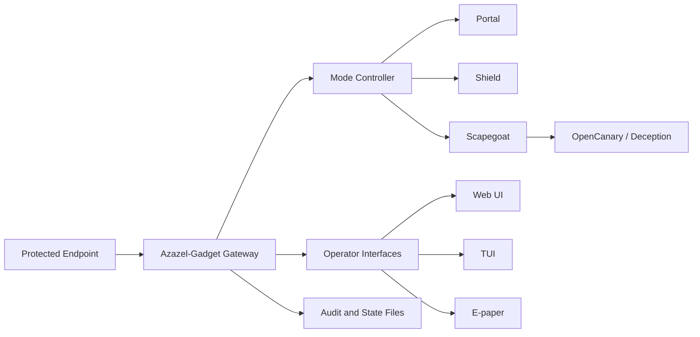

# AZ-02 Azazel-Gadget - パーソナル戦術防御ゲートウェイ

> **コードネーム:** `TACMOD`


[](https://github.com/01rabbit/Azazel-Gadget/actions/workflows/ci-tests.yml)
[](https://github.com/01rabbit/Azazel-Gadget/releases)
[](LICENSE)
[](docs/INDEX.md)
[](https://github.com/01rabbit/Azazel-Gadget/actions/workflows/pages.yml)


[](./README_ja.md)
[](./README.md)

Azazel-Gadget は Azazel システムの AZ-02 ポータブル構成であり、低信頼 Wi-Fi・敵対的ローカルセグメント・現場運用向けのパーソナル戦術防御ゲートウェイ / Cyber Scapegoat Gateway です。ユーザー端末と周辺ネットワークの間に立ち、初期ネットワーク挙動を観測し、`portal` / `shield` / `scapegoat` の決定論的モードで露出を制御し、Web UI・TUI・E-paper・（任意）ローカル通知で運用状態を可視化します。

Azazel-Gadget は VPN ではなく、汎用トラベルルーターでもなく、完全な攻撃防止を約束するものでもありません。

**対象ユーザー:** セキュリティ研究者、フィールド防御担当者、旅行者、インシデントレスポンダー、レッド/ブルーチーム運用者、および低信頼ネットワークでポータブル防御ゲートウェイを必要とするユーザー。

## 要件

| 要件 | 内容 |
|---|---|
| ハードウェア | Raspberry Pi Zero 2 W / Raspberry Pi 4 クラス |
| OS | Raspberry Pi OS / Linux |
| ランタイム | Python 3.x、Flask ベースのローカル Web UI |
| ネットワーク | 保護クライアント側 `usb0`、上流側 `wlan0` |
| 任意機能 | E-paper、OpenCanary、Suricata、ntfy、portal viewer |

## クイックスタート

```bash
sudo ./install.sh --all
# 再起動が必要な場合:
sudo ./install.sh --resume
```

最小確認:

```bash
sudo systemctl status azazel-mode azazel-first-minute azazel-control-daemon azazel-web --no-pager
```

## アーキテクチャ概要



## Azazel-Gadget が行うこと

- ポータブル防御ゲートウェイとして動作する。
- `portal` / `shield` / `scapegoat` の決定論的モードを提供する。
- 保護対象 `usb0` クライアントを上流からの inbound と分離する。
- Web UI・TUI・E-paper による可視性を提供する。
- 必要に応じて OpenCanary の隔離デコイ公開を行う。
- 実装されている範囲で Suricata / OpenCanary / ntfy 状態を反映する。
- 状態とモード変更を運用者レビュー可能な形で記録する。

## Security Boundary Summary

Azazel-Gadget の主張:

- ローカルファーストな防御ゲートウェイ挙動
- 運用者が明示選択するモード
- 上流 `wlan0` から保護側 `usb0` クライアントへの inbound 経路がないこと
- 監査可能な状態を伴う決定論的モード切替
- 保護クライアント側から分離された任意デコイ公開

Azazel-Gadget が主張しないこと:

- あらゆる敵対 Wi-Fi 攻撃への完全防御
- エンドポイント防御、VPN、企業 NAC の置き換え
- 自律的攻撃応答
- 不可視・無操作のセキュリティ
- アクティブモードを理解しないままでの安全運用

## Operating Modes

| Mode | 挙動 | EPD サンプル |
|---|---|---|
| `portal` | 保護対象 `usb0` クライアント向け NAT/ゲートウェイ挙動。デコイ公開は無効。 |  |
| `shield`（既定） | 既定の防御姿勢。`wlan0` からの inbound を遮断しつつ、保護側の outbound を維持。 |  |
| `scapegoat` | OpenCanary の許可ポートのみ公開。Canary は `az_canary` ネームスペースで隔離し、保護側と分離。 |  |

警告表示（モードではない）:

| 表示 | トリガー | EPD サンプル |
|---|---|---|
| `WARNING` | 監視パイプラインが警告条件を検知。 |  |

## ハードウェアバリエーション

| Azazel-Gadget Portable | Azazel-Gadget Dock |
|---|---|
| Raspberry Pi Zero 2 W 実装<br> | Raspberry Pi 3/4/4B 実装<br> |

## インターフェース

| Web UI | Unified TUI |
|---|---|
| [](images/WebUI.png) | [](images/TUI.png) |

リポジトリ内の運用インターフェース:

- Web UI バックエンドとダッシュボード: `azazel_web/`
- 統合 TUI モニタ/メニュー: `py/azazel_gadget/cli_unified.py`
- 互換メニューランチャー: `py/azazel_menu.py`
- 端末ステータス表示: `py/azazel_status.py`
- E-paper 描画/制御: `py/azazel_epd.py`, `py/boot_splash_epd.py`

## インストールオプション

エントリポイント: `install.sh`

| オプション | 効果 |
|---|---|
| `--with-canary` | OpenCanary を導入/有効化 |
| `--with-epd` | Waveshare E-Paper 依存を有効化（既定有効） |
| `--with-webui` | Flask venv + Caddy HTTPS リバースプロキシを導入 |
| `--with-ntfy` | ローカル ntfy サーバと通知連携を導入 |
| `--with-portal-viewer` | noVNC/Chromium Captive Portal Viewer 構成を導入 |
| `--all` | 上記の任意機能を一括有効化 |
| `--resume` | 再起動が必要なネットワーク段の後続処理を再開 |

## Web API

| Endpoint | 内容 |
|---|---|
| `GET /` | ダッシュボード HTML |
| `GET /api/state` | 現在スナップショット |
| `GET /api/state/stream` | 状態 SSE |
| `GET /api/mode` | 現在モード情報 |
| `POST /api/mode` | モード切替（`portal`/`shield`/`scapegoat`） |
| `GET /api/portal-viewer` | noVNC 状態/URL |
| `POST /api/portal-viewer/open` | portal viewer 起動/表示 |
| `GET /api/events/stream` | ntfy イベント SSE ブリッジ |
| `POST /api/action` | アクション（v1形式） |
| `POST /api/action/<action>` | アクション（legacy形式） |
| `GET /api/wifi/scan` | Wi-Fi スキャン |
| `POST /api/wifi/connect` | Wi-Fi 接続 |
| `GET /api/certs/azazel-webui-local-ca/meta` | ローカルCAメタ情報 |
| `GET /api/certs/azazel-webui-local-ca.crt` | ローカルCAダウンロード |
| `GET /health` | バックエンドヘルス |

許可アクション:
`refresh`, `reprobe`, `contain`, `release`, `details`, `stage_open`, `disconnect`, `wifi_scan`, `wifi_connect`, `portal_viewer_open`, `mode_set`, `mode_status`, `mode_get`, `mode_portal`, `mode_shield`, `mode_scapegoat`, `shutdown`, `reboot`

トークン認証:

- Header: `X-AZAZEL-TOKEN` または `X-Auth-Token`
- Query: `?token=...`

## Services (systemd)

| Unit | 役割 |
|---|---|
| `azazel-mode.service` | 起動時モード適用 (`azctl mode apply-default`) |
| `azazel-first-minute.service` | 制御プレーン本体 |
| `azazel-control-daemon.service` | Unix socket アクションデーモン |
| `azazel-web.service` | Flask API/UI バックエンド |
| `azazel-portal-viewer.service` | Captive Portal Viewer（noVNC） |
| `usb0-static.service` | `usb0` に固定IPv4を設定 |
| `azazel-nat.service` | NAT/forward 補助 |
| `azazel-epd.service` | E-paper 起動表示 |
| `azazel-epd-refresh.service` + `azazel-epd-refresh.timer` | E-paper 定期モード/状態更新 |
| `azazel-epd-shutdown.service` | E-paper 終了処理 |
| `azazel-epd-portal.service` + `azazel-epd-portal.timer` | Captive Portal 定期検知 |
| `suri-epaper.service` | Suricata 連動 E-paper 更新 |
| `opencanary.service` | OpenCanary サービス |
| `opencanary@.service` | 専用ネットワーク名前空間での OpenCanary |

## Documentation Map

主要エントリ:

- [Documentation Index](docs/INDEX.md)
- [Series Positioning and Terms](docs/SERIES_POSITIONING_AND_TERMS.md)
- [Security Claim Policy](docs/SECURITY_CLAIM_POLICY.md)
- [Installer Guide](installer/README.md)
- [Release Process](docs/RELEASE_PROCESS.md)
- [Release Notes Template](docs/RELEASE_NOTES_TEMPLATE.md)
- [Changelog](docs/CHANGELOG.md)
- [Presentation Assets](docs/presentation/README.md)
- [Docs Site Entry](docs/index.html)
- [Regression Test Notes](scripts/tests/regression/README.md)

## Repository Layout

| Path | 役割 |
|---|---|
| `py/azazel_gadget/` | コントローラ、センサー、tactics engine、path schema |
| `py/azazel_control/` | control daemon、Wi-Fi ハンドラ、アクションスクリプト |
| `azazel_web/` | Flask バックエンドとダッシュボード資産 |
| `systemd/` | service/timer ユニット |
| `installer/` | 段階的インストーラ構成 |
| `configs/` | 既定ランタイム設定 |
| `scripts/` | ランタイム補助とテストスクリプト |
| `docs/` | ドキュメントとプレゼン資産 |
| `images/` | README/プレゼン用画像資産 |

## ライセンス

このプロジェクトは MIT License で提供されます。詳細は [LICENSE](LICENSE) を参照してください。
