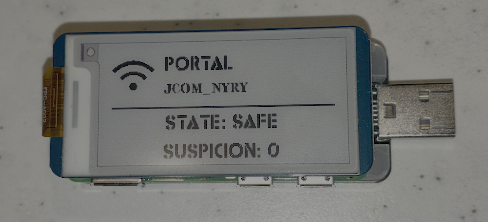
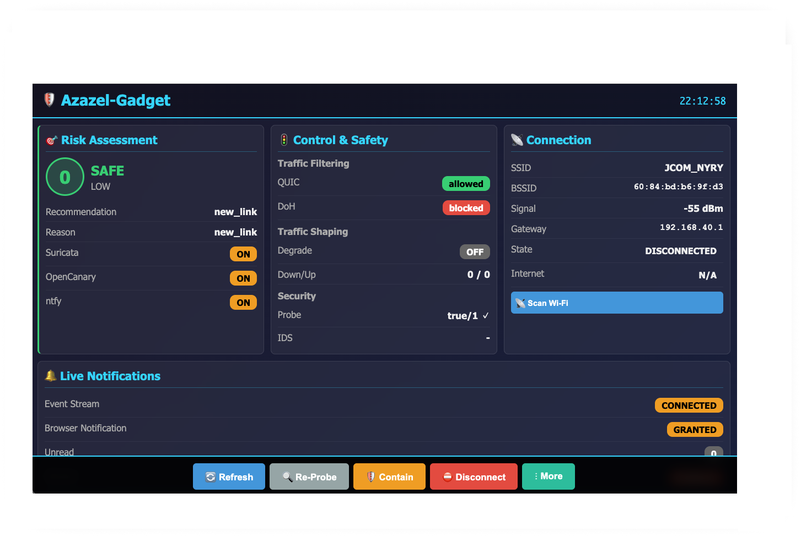
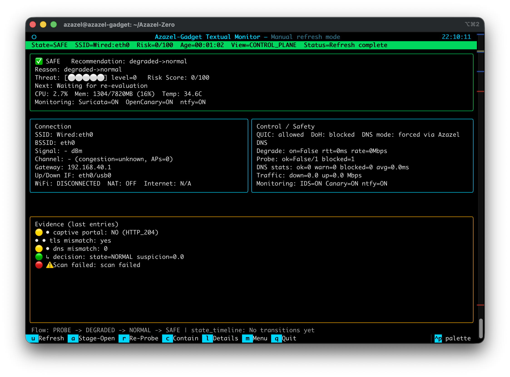
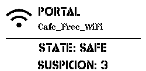

# AZ-02 Azazel-Gadget — Cyber Scapegoat Gateway

<p align="center">
  <a href="./README_ja.md">
    
  </a>
  <a href="./README.md">
    
  </a>
</p>

Azazel-Gadget（旧称 Azazel-Zero）は、不審な Wi-Fi 環境向けの携行型防御ゲートウェイです。主対象は Raspberry Pi Zero 2 W / Pi 4 クラスです。

<p align="center">
  
</p>
<p align="center">
  
  
  
  
  
  
</p>

## コンセプト

Azazel-Gadget は、常時携行できる「身代わり防壁」です。
公共 Wi-Fi のような低信頼ネットワーク環境において、ユーザー端末の前面に立ち、攻撃を直接受け止めることを前提に設計された個人向け戦術デバイスです。

本ツールは、単に通信を遮断する一般的なセキュリティ製品ではありません。攻撃者の行動原理を前提に、防御面を最小化し、横移動を遮断し、必要に応じて露出を制御できる構造を持ちます。デフォルトは完全防御（Shield）。しかし状況に応じて、観測的防御（Scapegoat）へと態勢を変更することが可能です。

攻撃を知らずに守るのではなく、攻撃を知った上で守る。
Azazel-Gadget は、防御専用機でありながら、戦術的判断を伴う装置です。平時は静かに防御し、異常時には態勢を変える。必要であれば攻撃を引き受け、観測し、時間を稼ぐ。

それは、日常的に携行できる前線装置です。
見えないセキュリティではなく、意識的に構えるための盾。

## ハードウェア実装バリエーション

| Azazel-Gadget Portable | Azazel-Gadget Shield |
|---|---|
| Raspberry Pi Zero W 実装<br> | Raspberry Pi 4 実装<br> |

## インターフェース プレビュー

| Web UI | 統合 TUI |
|---|---|
| [](images/WebUI.png) | [](images/TUI.png) |

Azazel-Gadget は、能動的なネットワーク防御と運用UI、任意のデコイ機能を一体化したポータブルゲートウェイです。

## 主な機能

### 1) first-minute 制御プレーン
- 上流接続状態とキャプティブポータルを監視し、`NORMAL`/`DEGRADED`/`CONTAIN` を制御。
- UI 用スナップショット JSON を生成。
- ローカル Status API（`:8082`）で `/action/*` と `/details` を提供。
- Tactics の意思決定ログ出力や ntfy 通知フックを実装。
- `DECEPTION` 時は、Suricata で OpenCanary 宛攻撃と判定した通信フローに限定して `tc` 遅延を適用（対象限定 Delay-to-Win）。

### 2) Control Daemon（Unix socket）
- `/run/azazel/control.sock` でアクション要求を受け付け。
- シェルスクリプト系アクション、Wi-Fi scan/connect、portal viewer 起動を実行。
- `watch_snapshot` によるスナップショット配信に対応。
- パススキーマ関連アクション（`path_schema_status`, `migrate_path_schema`）を提供。

### 3) Web UI バックエンド（Flask）
- ダッシュボード HTML、状態 API、状態 SSE。
- 新旧アクション API、Wi-Fi API、portal viewer API。
- ntfy ブリッジ SSE（`/api/events/stream`）。
- ローカル HTTPS 用 CA 証明書メタ情報/配布 API。
- トークン認証（トークンファイルが存在する場合）。

### 4) Portal Viewer（noVNC）
- Chromium + Xvfb + x11vnc + noVNC によるポータル操作支援。
- WebUI からオンデマンド起動して URL を返却。
- 実行時 start URL 上書きに対応。

### 5) E-paper 連携
- 起動/終了スプラッシュ表示。
- キャプティブポータル関連の定期表示更新。
- Suricata 連動表示更新。

### 6) 任意のローカル監視/デコイ
- OpenCanary ユニットと起動ラッパーを同梱。
- Suricata 稼働状態を WebUI に反映。
- 軽量 canary ルールは `wlan0` 上の同一LAN端末からの `22/80` スキャン/アクセス試行も検知対象。
- `--with-ntfy` でローカル ntfy サーバ（`:8081`）を導入可能。

## アーキテクチャ概要

0. `azazel-mode.service` + `azctl`
- 起動時の既定モードとして常に `shield` を適用（起動時は保存モードを無視）。
- ファイアウォール/sysctl/OpenCanary の適用を単一の実行系に集約。
- 監査ログと EPD 状態を更新。

1. `azazel-first-minute.service`
- 状態スナップショット生成と Status API（`:8082`）を提供。
2. `azazel-control-daemon.service`
- `/run/azazel/control.sock` 経由でアクション実行を仲介。
3. `azazel-web.service`
- Flask バックエンド（既定 `127.0.0.1:8084`）として状態取得/操作 API を提供。
4. 任意 `caddy.service`（`--with-webui`）
- `https://<MGMT_IP>:443` で Flask へリバースプロキシ。
5. 任意 `azazel-portal-viewer.service`
- 既定 `10.55.0.10:6080` の noVNC を必要時起動。

## モード

| モード | 挙動 | EPD サンプル |
|---|---|---|
| `portal` | `usb0` クライアント向けのインターネットゲートウェイ動作（`wlan0` 経由NAT）。`wlan0` 側のデコイ公開は OFF。 |  |
| `shield`（既定） | `usb0` クライアントの外向き通信を維持しつつ、`wlan0` からの inbound を遮断。デコイ公開は OFF。 |  |
| `scapegoat` | `wlan0` では OpenCanary 許可ポートのみ公開。OpenCanary は隔離 namespace（`az_canary`）で動作し、`usb0` への経路を持たない。 |  |

警告表示（モードではない）:

| 表示 | トリガー | EPD サンプル |
|---|---|---|
| `WARNING` | 監視パイプラインがアラート条件を検知した際に表示。 |  |

## 同梱サービス（systemd）

| Unit | 役割 |
|---|---|
| `azazel-first-minute.service` | 制御プレーン本体 |
| `azazel-control-daemon.service` | Unix socket アクションデーモン |
| `azazel-web.service` | Flask バックエンド |
| `azazel-portal-viewer.service` | Captive Portal Viewer（noVNC） |
| `usb0-static.service` | `usb0` 固定 IPv4 設定 |
| `azazel-nat.service` | iptables ベース NAT/forward 補助 |
| `azazel-epd.service` | E-paper 起動表示 |
| `azazel-epd-shutdown.service` | E-paper 終了表示 |
| `azazel-epd-portal.service` + `.timer` | ポータル検知表示更新 |
| `suri-epaper.service` | Suricata 連動 E-paper 更新 |
| `opencanary.service` | 任意デコイサービス |

## インストールオプション

エントリポイント: `install.sh`

| オプション | 効果 |
|---|---|
| `--with-webui` | Flask venv + Caddy HTTPS を導入 |
| `--with-canary` | OpenCanary を導入/有効化 |
| `--with-ntfy` | ローカル ntfy サーバ（`:8081`）導入 |
| `--with-portal-viewer` | noVNC/Chromium 構成を導入 |
| `--with-epd` | Waveshare E-Paper 依存導入（既定 ON） |
| `--all` | 上記オプションを一括有効化 |
| `--resume` | 再起動後の続きから実行 |

例:

```bash
sudo ./install.sh --all
# 再起動が必要になった場合
sudo ./install.sh --resume
```

## Web API 一覧

| Endpoint | 内容 |
|---|---|
| `GET /` | ダッシュボード |
| `GET /api/state` | 状態 + 監視状態 + portal viewer 状態 |
| `GET /api/state/stream` | 状態 SSE |
| `GET /api/events/stream` | ntfy ブリッジ SSE |
| `GET /api/portal-viewer` | noVNC 状態/URL |
| `POST /api/portal-viewer/open` | portal viewer 起動/URL返却 |
| `POST /api/action` | 新形式アクション |
| `POST /api/action/<action>` | 旧形式アクション |
| `GET /api/wifi/scan` | Wi-Fi スキャン（既定でトークン不要） |
| `POST /api/wifi/connect` | Wi-Fi 接続 |
| `GET /api/certs/azazel-webui-local-ca/meta` | ローカルCAメタ情報 |
| `GET /api/certs/azazel-webui-local-ca.crt` | ローカルCAダウンロード |
| `GET /health` | Web バックエンドヘルス |

許可アクション:
`refresh`, `reprobe`, `contain`, `release`, `details`, `stage_open`, `disconnect`, `wifi_scan`, `wifi_connect`, `portal_viewer_open`, `shutdown`, `reboot`

トークン認証:
- Header: `X-AZAZEL-TOKEN` / `X-Auth-Token`
- Query: `?token=...`

## インターフェース

- Web UI: `azazel_web/`
- 統合 TUI（モニタ/メニュー）: `py/azazel_gadget/cli_unified.py`
- 互換ランチャー: `py/azazel_menu.py`
- 端末ステータス表示: `py/azazel_status.py`
- E-paper 描画/制御: `py/azazel_epd.py`, `py/boot_splash_epd.py`

## テスト

- 単体テスト: `tests/`
- 回帰テストスクリプト: `scripts/tests/regression/`
- UIスタックスモーク: `scripts/tests/e2e/run_ui_stack_smoke.sh`

## パス互換性

2系統の命名をサポートしています。
- 標準: `azazel-gadget`（`/etc/azazel-gadget`, `/run/azazel-gadget`, `~/.azazel-gadget`）
- 旧名: `azazel-zero`（`/etc/azazel-zero`, `/run/azazel-zero`, `~/.azazel-zero`）

スキーマ補助/移行は `py/azazel_gadget/path_schema.py` で提供しています。
旧パス互換は `2026-12-31` までを目安に維持予定です。

## ディレクトリ構成（主要）

| Path | 内容 |
|---|---|
| `py/azazel_gadget/` | 制御、センサー、Tactics、パススキーマ |
| `py/azazel_control/` | 制御デーモン、Wi-Fi処理、アクションスクリプト |
| `azazel_web/` | Flask バックエンド + フロント |
| `systemd/` | service/timer ユニット |
| `installer/` | 段階的インストーラ |
| `configs/` | 既定設定テンプレート |
| `scripts/` | 実行補助とテストスクリプト |
| `docs/` | 開発/アーカイブ文書 |

## ライセンス

リポジトリ内の `LICENSE`（存在する場合）を参照してください。
